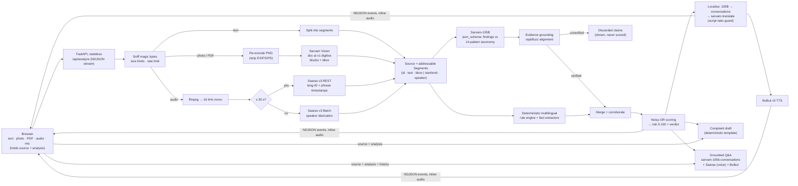

# Kavach (कवच) — a shield against scams, in your own language

**Live demo: https://kavach-kappa.vercel.app**

**Kavach** helps people in India check whether a **call recording, voice note, photo of a notice, PDF or SMS** is a scam, and understand genuine paperwork. It explains the result **and speaks it** in the person's own language.

- **Understands** 22 Indian languages + English (text, speech, documents). **Speaks** in 11 via Bulbul v3.
- **Accepts** pasted text, photos (JPG/PNG/WebP), PDFs (up to 10 pages), audio files (MP3/M4A/OGG/WAV/…) and live mic recordings.
- **Returns** a verdict and a 0–100 risk score, plus red flags with **exact, verified quotes**. Each quote is linked to the **bounding box on the image** or the **timestamp in the call**. It also pulls out key facts (UPI IDs, phone numbers, amounts, deadlines), gives a spoken explanation in the person's language, answers **voice questions grounded in the content**, and writes a **cybercrime complaint draft** (1930 helpline, cybercrime.gov.in, Sanchar Saathi Chakshu).

---

## The problem

Scams like "digital arrest", fake KYC, courier and parcel threats, task-based jobs and fake refunds are named in repeated advisories from I4C (cybercrime.gov.in) and RBI. The people most at risk are elderly, first-time smartphone users or not comfortable reading English. They get these calls and messages in Hindi, Tamil, Bengali and many other languages. Most "scam checkers" work in English only, handle text only, and give a verdict with no evidence behind it.

Kavach works with the actual call, voice note or document photo, in the language it came in. Each claim it makes points back to the exact place in that content.

## Demo flow (≈ 60 seconds)

1. Open `http://localhost:8000` and tap the **"Digital arrest" call** sample (Hindi, 45 s, two speakers).
2. Progress streams live: *Listening (Saaras v3 Batch + diarization) → Checking for fraud patterns (Sarvam-105B + rules) → Explaining in Hindi → Recording a voice explanation (Bulbul v3)*.
3. Result: **Scam — 100/100**. There are six red flags and every one is corroborated by both the AI and the rules. Tap a red flag and the player jumps to that moment in the call, labelled with the speaker.
4. Press play to hear the explanation in Hindi. Then ask by voice: *"क्या मुझे पैसे भेजने चाहिए?"* ("Should I send money?"). The answer is spoken back, and it only uses what is in the call.
5. Open **Complaint draft**. It is filled in from verified data only and is ready for 1930 or cybercrime.gov.in.
   Nothing is kept on the server: **Clear this page** wipes it from the browser.
6. Try the **"CBI" notice** photo. Each red flag is highlighted on the image. Then try the Tamil **electricity notice** photo. It is genuine, so Kavach gives **low risk 0** and explains the amount due and the deadline.
7. Open the **Trace** panel. It lists every Sarvam API call with its latency, and the claims the AI made that Kavach **discarded** because they are not in the source.

## Architecture



See [docs/ARCHITECTURE.md](docs/ARCHITECTURE.md) for the pipeline, data model, scoring formula and event stream schema.

## Sarvam APIs used

| API | Model | What Kavach uses it for | Verified behaviour (live, 27 Sep 2026) |
|---|---|---|---|
| Speech-to-Text REST | `saaras:v3` | Clips ≤ 30 s (voice notes, spoken questions): transcript, language ID, phrase-level timestamps (word-level is not offered) | Hard limit 30 s. Automatic language ID with a probability. A 16 s clip takes 2.2 s. |
| Speech-to-Text Batch | `saaras:v3` + diarization | Calls > 30 s: who said what, and when | A 45 s two-speaker call takes 7.4 s. SDK `create_job()` defaults to the legacy `saarika:v2.5`, so Kavach **always passes the model explicitly**. |
| Sarvam Vision Document Intelligence | doc-ai v1 `digitise` | Photos and PDFs → text blocks with normalised bounding boxes, in reading order | About 6 s per image. Max 10 pages per job. **10 req/min on all plans**, so Kavach polls with backoff. |
| Chat completions | `sarvam-105b` | Evidence extraction against a fixed taxonomy using `json_schema` structured output. Also used for localisation. | 128K context. Reasoning disabled (`reasoning_effort=None`): about 12 s instead of 166–255 s, and quotes were still verified 5/5. Schema is accepted, but the content still needs validation (see "Technical depth"). |
| Chat completions | `sarvam-105b-conversations` | Grounded follow-up Q&A. Fallback localiser. | Used in multi-turn chat with bounded history. |
| Text translation | `sarvam-translate:v1` | Last-resort localisation and Q&A language repair | Covers all 22 languages. 2,000 chars per request, so Kavach chunks at sentence boundaries. |
| Text-to-Speech | `bulbul:v3` | Spoken explanation and spoken answers | 2,500 chars per request, 30+ voices, 11 languages. The SDK parameter is `language_code`. Kavach chunks at 450 chars in parallel and stitches the WAVs. |

SDK: official `sarvamai` Python SDK **0.1.34**. All calls go through a single gateway (`kavach/sarvam.py`).

## Technical depth: decisions that matter

1. **The LLM never decides the verdict.** In testing, Sarvam-105B returned pairs that contradicted themselves: verdict *"suspicious"* with risk **1**, and *"suspicious"* with risk **95**. So the LLM only **extracts findings** against a fixed **14-pattern taxonomy** (`kavach/patterns.py`), built from I4C / cybercrime.gov.in and RBI advisories. Arithmetic sets the risk: a **noisy-OR** of each verified finding's `weight × severity`. Rule-only findings count at a 0.5 discount, and findings flagged by both the AI and the rules get a ×1.15 boost. Every point of the score can be traced to a finding.
2. **Evidence grounding.** Every quote from the AI is fuzzy-aligned to the source with `rapidfuzz` partial alignment. The text is NFC-normalised with nuktas and ZWJ/ZWNJ removed first. A quote below 82/100 is marked **discarded**. It is still shown to the user but never raises the risk. This was needed because the model sometimes *translated* quotes it had been told to copy word for word, and OCR adds small vowel-sign errors.
3. **Neuro-symbolic by design.** A deterministic multilingual rule engine (`kavach/signals.py`) runs offline on every input. It includes native-script transliterations like **ओटीपी / ஓடிபி / கேவைசி**, because Saaras writes spoken "OTP"/"KYC" in the speaker's script. The rules confirm AI findings, extract facts (UPI, phone, amounts, links, deadlines), and keep Kavach working in a **degraded mode** if the LLM is down.
4. **Wrong-language guard.** The localised output is checked by **Unicode script ratio**. The observed failure was: we asked for Tamil and got Hindi or English. When the check fails, Kavach retries with `sarvam-105b-conversations` and then `sarvam-translate:v1`.
5. **Deterministic complaint draft.** It is filled from a template using verified quotes, timestamps or pages, and extracted identifiers only. There is no LLM prose in a document the person might submit to the police.
6. **Resilience.**
   - Retries use exponential backoff with jitter, honour `Retry-After`, and trigger on 408/409/425/429/5xx.
   - Each API has its own concurrency limit (semaphore), sized to the documented rate limits.
   - Vision status polling backs off.
   - Progress streams to the UI as NDJSON.
   - Each request records a trace of every Sarvam call, and the UI shows it.
   - **LLM latency and loops.** Reasoning is off (`reasoning_effort=None`). We measured about 12 s against 166–255 s with reasoning on, and quotes were still verified 5/5.
   - About 1 in 6 generations fell into a repetition loop. A normal analysis is 230–1,170 tokens, so `max_tokens` is capped at 2,000 and a loop fails fast.
   - `chat_json` makes up to 3 attempts: the same model at a slightly higher temperature, then `sarvam-105b-conversations`. Loops are random, so a plain retry recovers. We tried `frequency_penalty` and removed it: on Hindi input it made 6/6 attempts run to the cap with broken JSON (vs 4/4 clean without it); the live screenshots caught this as a degraded result.
7. **Addressable evidence.** Every input becomes a list of `Segment`s: an OCR block with a bbox, a diarized utterance with start/end and speaker, or a sentence. Findings point to segment ids, which lets the UI highlight the image region or seek the audio to that moment.

## Responsible AI & privacy

- **Stateless: nothing about user content is stored on the server.** There is no session store, no database and no TTL. The browser holds the source and analysis and sends them back for Q&A and the complaint draft. **Clear this page** wipes it from the browser. Context bodies are validated with pydantic and capped at 600 KB.
- **Uploads are sanitised.**
  - File type is detected from magic bytes; the file extension is ignored.
  - Size limits apply.
  - Images are **re-encoded to PNG**, which strips EXIF/GPS metadata.
  - Audio is normalised by ffmpeg with timeouts.
- **Web hardening.**
  - Strict **CSP**, `X-Frame-Options: DENY`, `nosniff`, `no-referrer`, and a scoped `Permissions-Policy`.
  - Rate limiting per IP (per instance on serverless).
  - Links found inside the analysed content are **rendered as plain text, never clickable**.
- **Honest output.** Discarded AI claims are shown as discarded. The explanation is framed as guidance, not a legal finding. Q&A answers come only from the content, never tell the person to pay, share an OTP or call numbers found in the content, and point to **1930** and **cybercrime.gov.in**.
- **Secrets.** `SARVAM_API_KEY` is read from the environment or `.env`. It is never logged, and never baked into the Docker image.

## Quick start

Requires **Python 3.12**. Audio uses the system ffmpeg if it is on `PATH`. Otherwise it uses the static binary from the `imageio-ffmpeg` package.

```bash
pip install -r requirements.txt
cp .env.example .env            # then set SARVAM_API_KEY
python scripts/make_samples.py  # optional: samples are already in samples/
uvicorn kavach.app:app --reload --port 8000
```

Open **http://localhost:8000**. Interactive API docs are at **http://localhost:8000/api/docs**.

`python scripts/hello_sarvam.py` is a one-line check that your API key works.

### Deploy to Vercel

FastAPI deploys with zero config. `pyproject.toml` sets `[tool.vercel] entrypoint = "kavach.app:app"`, and Python streaming is on by default.

```bash
vercel env add SARVAM_API_KEY
vercel env add KAVACH_MAX_UPLOAD_MB   # enter 4 (Vercel's request body limit is 4.5 MB)
vercel --prod
```

Vercel's limits and how Kavach fits them:
- **Request body 4.5 MB.** Set `KAVACH_MAX_UPLOAD_MB=4`.
- **300 s maximum function duration on Hobby.** The batch STT and Vision job timeout is 240 s.
- **No system ffmpeg.** The `imageio-ffmpeg` static binary is used instead.
- **Rate limits are per instance.** Serverless instances don't share state.

### Docker

```bash
docker build -t kavach .
docker run --rm -p 8000:8000 --env-file .env kavach
```

Use this for self-hosting. The image is `python:3.12-slim` with ffmpeg. It runs as a non-root user and has a health check on `/api/health`. The API key is supplied only at runtime.

### API at a glance

| Method | Path | Purpose |
|---|---|---|
| `POST` | `/api/analyze` | `file` / `text` / `sample` + `language` → NDJSON event stream. The spoken explanation arrives inline as base64 WAV. |
| `POST` | `/api/ask` | Multipart: `context` = JSON `{source, analysis, history[]}`, plus `question` or `audio`, plus `language` → `{question, answer, language, mime, audio_b64 \| null}` |
| `POST` | `/api/complaint` | JSON `{source, analysis}` → deterministic complaint draft (`text/plain`) |
| `GET` | `/api/health`, `/api/config` | Health / languages, samples, limits |

## Tests & evaluation

```bash
pip install pytest pytest-asyncio   # requirements-dev
python -m pytest -q                 # 151 offline tests: grounding, rules, scoring, ingest, API
python eval/run_eval.py             # labelled eval set → metrics (results in eval/results/)
python scripts/smoke.py             # full live pipeline on every bundled sample
```

Suggested dev pins: `pytest>=9.1`, `pytest-asyncio>=1.4`.

**Bugs the test suite caught (all fixed):**
- Grounding accepted made-up quotes that were longer than a short segment. It now aligns against windows of up to 3 consecutive segments, and uses a full ratio when the quote is longer than the window.
- The rule engine only checked the first occurrence of each keyword.
- A UPI ID followed by a full stop was missed.
- Advice text like "the bank never asks for your OTP" triggered red flags. Suppression now works per clause or sentence and checks for request verbs.
- `chunk_text` dropped newlines.

**Evaluation** (`eval/`, 40 hand-written cases: 20 scam / 20 genuine, 10 languages + Hinglish, with hard negatives such as real OTP messages and "the bank never asks for your OTP" advisories). One analysis per case; the ablation re-scores the same run, so it costs no extra API calls. Full report: [`eval/results/report.md`](eval/results/report.md).

| System | Run 1 accuracy | Run 1 F1 | Run 2 accuracy | Run 2 F1 | Run 2 false-positive rate |
|---|---|---|---|---|---|
| Rules only | 55.0% | 40.0% | 62.5% | 44.4% | 5% |
| AI only (verified claims) | 92.5% | 92.3% | 100% | 100% | 0% |
| **Fused (what Kavach shows)** | **90.0%** | **90.0%** | **100%** | **100%** | **0%** |

Evidence verification: 96.4% (run 1) and 96.8% (run 2) of AI-cited quotes were found in the source; the rest were discarded and did not affect the score. Latency p50 5.7 s, p95 41 s (text cases, run 2).

Between the runs we fixed what run 1 exposed: genuine OTP-delivery messages being flagged (rules now recognise a delivered code and "valid for N minutes"; the prompt states that safety advice is a sign of a genuine message), Hinglish advisory phrases, and LLM repetition loops (retry, then fall back to the conversations model; degraded runs went from 2 to 0). **Caveat:** these fixes were made after looking at this same set, so run 2 is a development-set score, not a held-out one. The dataset is small and synthetic; a larger held-out set is on the roadmap.

**Smoke results on the bundled samples** (live Sarvam APIs, `python scripts/smoke.py`, 27 Sep 2026):

| Sample | Result | End-to-end |
|---|---|---|
| Hindi "digital arrest" call (45 s, 2 speakers) | **scam 100**, 6 red flags (5 confirmed by both AI and rules) | 23.5 s |
| Tamil KYC voice note (16 s) | **scam 99** | 14.5 s |
| Hindi fake "CBI" notice (photo) | **scam 99**, UPI ID / phone / amount extracted | 17–78 s* |
| Tamil genuine electricity notice (photo) | **low risk 0**, amount and deadline extracted | 16.7 s |
| English part-time job SMS | **scam 97** | 15.0 s |
| Hindi genuine bank debit SMS ("bank never asks for OTP") | **low risk 0** (hard negative) | 11.2 s |

End-to-end includes STT/OCR, analysis, localisation and speech synthesis. *One run hit a runaway generation and retried; token budgets are now capped so a runaway fails fast. Disabling Sarvam-105B reasoning (`reasoning_effort=None`) cut analysis from 166–255 s to ~5–12 s with no loss in verified quotes on our samples.

**Live deployment** (`https://kavach-kappa.vercel.app`, Vercel, 27 Sep 2026):

| Sample | Result | End-to-end |
|---|---|---|
| Genuine Hindi bank SMS | low risk 0 | 14 s |
| Tamil KYC voice note (REST STT) | scam 98 | 17 s |
| Fake "CBI" notice photo (Sarvam Vision) | scam 100 | 25 s |
| 45 s Hindi "digital arrest" call (batch STT + diarization) | scam 100 | 64 s |

## Project layout

```
kavach/     config · languages · models · trace · sarvam (gateway) · ingest · patterns
            signals (rules) · grounding · scoring · analyzer · store (rate limiter) · pipeline · app
web/        index.html · styles.css · app.js (no framework, CSP-friendly)
samples/    demo inputs (Hindi call, Tamil voice note, Hindi "CBI" notice, Tamil power notice)
scripts/    make_samples.py (Bulbul-voiced calls, rendered notices) · smoke.py · hello_sarvam.py
tests/      pytest suite          eval/   labelled eval harness
docs/       ARCHITECTURE.md · PITCH.md
```

## Limitations & roadmap

**Limitations today**
- Vercel caps uploads at 4 MB and job timeouts at 240 s. Self-host with Docker for bigger files or longer calls.
- The rate limiter keeps its counts in memory, so on serverless each instance counts separately. It keys on the client IP. `X-Forwarded-For` is honoured only when `KAVACH_TRUST_PROXY=1` (set this only behind a proxy you control).
- Voice output covers 11 languages. The other 11 get text only.
- HEIC photos are not supported yet.
- The eval set is small and mostly synthetic.
- Kavach gives guidance, not a legal or forensic judgement.

**Roadmap**
- **WhatsApp bot**, since that is where scam messages actually arrive, built on the **Sarvam voice agents MCP**. Forward a voice note or photo and get a spoken verdict back.
- **Phone line**: call a number and get a live second opinion, using **Sarvam Voice Agents**.
- **Shared rate limiting** (Redis or Vercel KV) across serverless instances.
- **More eval data**: real anonymised cases from partner NGOs and cyber cells, per-language precision and recall, and adversarial paraphrases.
- **Keyterms with `saaras:v4`**, to bias STT toward terms like UPI handles, agency names and "digital arrest".
