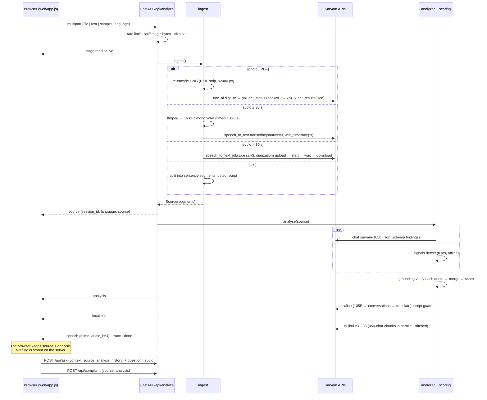

# Kavach architecture

Kavach's backend is **stateless**. Nothing about user content is stored on the server. The browser keeps the `source` and `analysis` it received and sends them back for Q&A and the complaint draft. That lets the same code run on Vercel serverless functions or in Docker.

This document covers the request pipeline, the data model, how the risk score is computed, and the NDJSON event stream the UI consumes. For the overview and a diagram, see the [README](../README.md).

## 1. Modules

| Module | Responsibility |
|---|---|
| `kavach/config.py` | `Settings` built from environment variables and `.env` (real environment variables win). Model names, limits, timeouts. |
| `kavach/languages.py` | 22 Indian languages + English. Script, TTS support, and Bulbul speaker for each. Script-ratio language check. |
| `kavach/models.py` | Pydantic domain models: `Segment`, `Source`, `Evidence`, `Finding`, `KeyFact`, `Analysis`, `Localized`. |
| `kavach/trace.py` | Per-request trace held in a context variable. Each Sarvam call becomes a `Span(name, api, ms, ok, detail)`. |
| `kavach/sarvam.py` | `SarvamGateway`, the only place Sarvam is called. Handles retries, backoff, per-API semaphores, JSON parsing, chunking and WAV stitching. |
| `kavach/ingest.py` | Detects file type from magic bytes, normalises images and audio, runs Vision or STT, and returns a `Source` of segments. |
| `kavach/patterns.py` | The 14-pattern fraud taxonomy with weights, plus the severity factors. |
| `kavach/signals.py` | Unicode normalisation, the multilingual lexicon rule engine, and regex fact extractors. |
| `kavach/grounding.py` | Checks each LLM quote against the source with fuzzy alignment. |
| `kavach/scoring.py` | Merges AI and rule findings, marks corroboration, and computes the noisy-OR risk and verdict. |
| `kavach/analyzer.py` | LLM prompts and schemas: analyse, localise (with fallbacks), grounded Q&A, and the deterministic complaint draft. |
| `kavach/store.py` | Sliding-window rate limiter per IP (in memory, per instance). There is no session store. |
| `kavach/pipeline.py` | Orchestration. Emits the NDJSON progress and result events. |
| `kavach/app.py` | FastAPI routes, security headers, static web app and sample catalogue. Validates the context bodies sent back by the browser (pydantic, 600 KB cap). |

## 2. Pipeline



### 2.1 Ingestion paths

| Input | Detection | Pre-processing | Sarvam call | Segment granularity |
|---|---|---|---|---|
| Text | form field | trim, cap at 12,000 chars, split on `. ! ? ।` and newlines | none | sentence (`t1`, `t2`, …) |
| Photo (PNG/JPEG/GIF/WebP) | magic bytes | EXIF transpose, convert to RGB, cap longest side at 2400 px, re-encode as PNG | Vision doc-ai v1 `digitise` | OCR block with `bbox_norm` and page (`p1b3`) |
| PDF | `%PDF` | none (10-page job cap) | Vision doc-ai v1 `digitise` | OCR block with bbox and page |
| Audio ≤ 29.5 s | RIFF/WAVE, ID3, OggS, fLaC, EBML, AMR, MPEG, ftyp | ffmpeg → 16 kHz mono WAV, capped at `KAVACH_MAX_AUDIO_SECONDS` | STT REST `saaras:v3`, `with_timestamps` | word with start/end (`u1`, …) |
| Audio > 29.5 s | same | same | STT Batch `saaras:v3`, `with_diarization` | diarized utterance with start/end and speaker |
| HEIC | ftyp `heic`/`heif` | rejected with a friendly message | none | none |

### 2.2 Analysis

1. **Rules first.** `signals.detect(segments)` runs lexicon matching on normalised text, checking word boundaries for Latin-script phrases. It returns `Finding(source="rule")` with exact character spans, so rule findings are verified by construction.
   - Every occurrence of a keyword is checked, not only the first.
   - Advice text (for example "the bank never asks for your OTP") is suppressed per clause or sentence, unless that clause contains a request verb.
   - The UPI regex handles an ID followed by a full stop.
2. **LLM extraction.** `sarvam-105b` receives the segments as `[segment_id speaker=… t=…s page=…] text`. It returns the `ANALYSIS_SCHEMA` fields: `document_kind`, `claimed_sender`, `summary`, `suspected_caller_speaker`, `findings[{pattern_id ∈ taxonomy, segment_id, quote, explanation, severity}]`, `legitimacy_indicators`, `key_facts`, `recommended_actions`.
   - **Reasoning is disabled** (`reasoning_effort=None`). We measured about 12 s against 166–255 s with reasoning on. With reasoning on, reasoning tokens could also use up `max_tokens` and truncate the JSON. Quotes were still verified 5/5 with reasoning off.
   - **`max_tokens` is capped at 2,000.** A normal analysis is 230–1,170 tokens, but about 1 in 6 generations fell into a repetition loop. The cap makes a loop fail fast.
   - **Up to 3 attempts** for invalid JSON. Each retry adds `frequency_penalty=0.5` and raises the temperature by 0.2 (up to 0.7). In testing this broke the loops, and 14/14 quotes were still verified.
3. **Grounding.** Each AI quote goes through `grounding.verify(quote, segment_id, segments)`:
   - Normalise both sides: NFC, casefold, and drop nuktas and ZWJ/ZWNJ/ZWSP. An index map back to the original offsets is kept.
   - Align against **windows of 1–3 consecutive segments**, starting at the **cited** segment and then trying all the others. A quote can legitimately span several STT phrase chunks.
   - Use `rapidfuzz.fuzz.partial_ratio_alignment` when the quote fits inside the window. When the quote is **longer** than the window, use the **full ratio** instead. This closes a bug the tests found: a made-up long quote could get a high partial score against a short segment.
   - If the score is ≥ **82**, the quote is `verified`, and the segment id and character span are corrected to the best match.
   - Otherwise it goes into `rejected_claims`. The UI shows it as discarded and it is never scored.
4. **Merge.** Every verified AI finding is kept. A rule finding is added only if its pattern is not already covered by the AI. An AI finding whose pattern also fired in the rules is marked `corroborated = true`.
5. **Score.** See §4.
6. **Degraded mode.** If the LLM call fails after retries, `raw = {}`, `degraded = true`, and the score is computed from the rules alone. In that case the recommended actions come from `default_actions(verdict)`.

### 2.3 Localisation, speech, Q&A, complaint

- **Localise.** First `sarvam-105b`, then `sarvam-105b-conversations`, each through `LOCALIZE_SCHEMA` (headline, explanation, actions).
  - A result is accepted only if `languages.is_in_language(text, code)`: at least 60% of its letters must be in the target script.
  - Otherwise it falls back to `sarvam-translate:v1` (sentence-chunked, ≤ 1,800 chars per request), and after that to English.
  - `Localized.method` records which path was used: `llm`, `translated` or `english`.
- **Speech.** Bulbul v3 with `language_code`, a per-language speaker, pace 0.95 and 22.05 kHz WAV.
  - Text is split into ~450-char sentence chunks that are synthesised concurrently and joined with 250 ms gaps.
  - Newlines are kept when chunking.
  - The WAV is sent **inline** in the `speech` event as base64. The UI turns it into a `blob:` URL.
- **Q&A** (`POST /api/ask`, stateless).
  - The browser sends `context` = `{source, analysis, history[]}`. It is validated and capped at 600 KB.
  - The system prompt contains the verdict, the red flags and the segment-tagged content (up to 20K chars), with the last 8 turns of history.
  - The model is told to answer only from that content, and never to advise paying, sharing an OTP or calling numbers found in the content.
  - Voice questions are transcribed with Saaras REST (≤ 29 s).
  - If the reply fails the script check at 50%, it is translated.
  - The answer is spoken with Bulbul and returned inline as `audio_b64`. If the language has no voice support, `audio_b64` is `null`.
- **Complaint** (`POST /api/complaint` with `{source, analysis}`). `analyzer.complaint()` is a pure function of `Source` and `Analysis`. It contains:
  - the medium, the claimed sender and the risk;
  - the identifiers found, grouped by label;
  - each verified quote with its `[mm:ss, speaker]` or `[page n]`;
  - pointers to 1930, cybercrime.gov.in and Sanchar Saathi (Chakshu).

## 3. Data model

```text
Source
├─ modality: text | image | pdf | audio
├─ language, language_confidence        (Saaras language ID, or detected script)
├─ filename, duration (s), pages
└─ segments: [Segment]
     ├─ id           t1 | p1b4 | u12
     ├─ text
     ├─ page, bbox   normalised [x1, y1, x2, y2]        (documents)
     └─ start, end, speaker                             (audio)

Analysis
├─ document_kind, claimed_sender, summary, suspected_caller
├─ findings: [Finding]           verified, merged, sorted by contribution
│    ├─ pattern_id, pattern_name, source: ai | rule, severity: high | medium | low
│    ├─ explanation, corroborated
│    └─ evidence: {segment_id, quote, score 0-100, verified, start_char, end_char}
├─ rejected_claims: [Finding]    AI claims that failed grounding
├─ legitimacy_indicators: [str]
├─ key_facts: [{kind, label, value, segment_id}]   deadline · amount · account_or_upi · contact · link …
├─ actions: [{text, priority: now | soon | optional}]
├─ risk_score 0-100, verdict: scam | suspicious | low_risk
├─ score_breakdown: [{pattern_id, pattern, source, severity, corroborated, weight}]
└─ degraded: bool

Localized { language, headline, explanation, actions[], method: llm | translated | english }

Client-held context (the browser keeps it; the server stores nothing)
  POST /api/ask       context = { source: Source, analysis: Analysis, history: [{role, content}] }   (≤ 600 KB)
  POST /api/complaint { source: Source, analysis: Analysis }                                        (≤ 600 KB)
```

## 4. Scoring

The LLM never outputs the verdict or the risk. For each **verified** finding *i*:

```
c_i = min( 0.95,  weight(pattern_i) × severity_factor(sev_i)
                  × (0.5  if source_i == "rule")
                  × (1.15 if corroborated_i) )
```

Only the **strongest finding per pattern** counts, so repeating a phrase cannot inflate the score. The findings are then combined with noisy-OR:

```
risk    = round( 100 × (1 − Π_i (1 − c_i)) )
verdict = scam        if risk ≥ 70
        = suspicious  if risk ≥ 35
        = low_risk    otherwise
```

Severity factors: **high 1.0 · medium 0.65 · low 0.35**.

### Pattern weights (`kavach/patterns.py`)

The values under High, Medium and Low are the resulting contributions for an AI finding (before the corroboration boost and the 0.95 cap).

| Pattern | Name | Weight | High | Medium | Low |
|---|---|---:|---:|---:|---:|
| `DIGITAL_ARREST` | Fake "digital arrest" / arrest threat | 0.90 | 0.90 | 0.59 | 0.32 |
| `CREDENTIAL_REQUEST` | Asks for OTP / PIN / password | 0.85 | 0.85 | 0.55 | 0.30 |
| `REMOTE_ACCESS` | Screen-sharing / unknown app | 0.80 | 0.80 | 0.52 | 0.28 |
| `PAYMENT_TO_UNOFFICIAL` | Money to a personal / "safe" account | 0.70 | 0.70 | 0.46 | 0.25 |
| `SECRECY_ISOLATION` | Tells you to keep it secret | 0.60 | 0.60 | 0.39 | 0.21 |
| `PARCEL_CONTRABAND` | Fake parcel / courier case | 0.60 | 0.60 | 0.39 | 0.21 |
| `JOB_INVESTMENT_LURE` | Job tasks / guaranteed returns | 0.55 | 0.55 | 0.36 | 0.19 |
| `AUTHORITY_IMPERSONATION` | Claims police / CBI / RBI / court | 0.50 | 0.50 | 0.33 | 0.18 |
| `KYC_ACCOUNT_BLOCK` | Account / SIM will be blocked | 0.50 | 0.50 | 0.33 | 0.18 |
| `PRIZE_REFUND_LURE` | Prize, lottery, refund lure | 0.50 | 0.50 | 0.33 | 0.18 |
| `SUSPICIOUS_LINK` | Suspicious link or file | 0.50 | 0.50 | 0.33 | 0.18 |
| `URGENCY_PRESSURE` | Extreme urgency or threats | 0.35 | 0.35 | 0.23 | 0.12 |
| `UNOFFICIAL_CONTACT` | Official matter over personal channels | 0.35 | 0.35 | 0.23 | 0.12 |
| `OTHER_RED_FLAG` | Other concrete red flag | 0.30 | 0.30 | 0.20 | 0.11 |

**Worked example.** Take the Hindi digital-arrest call:
- `DIGITAL_ARREST` is high and corroborated: 0.9 × 1.15 = 1.035, capped at 0.95.
- `AUTHORITY_IMPERSONATION` is high and corroborated: 0.575.
- `SECRECY_ISOLATION` is high and corroborated: 0.69.

1 − (0.05 × 0.425 × 0.31) = 0.9934, so the risk is **99**. The call's other corroborated flags push it to **100**.

Compare the genuine Tamil electricity notice. No flags survive grounding, so the product over findings is empty and the risk is **0**.

Every call to `score()` also returns `score_breakdown`, so the UI can show exactly which findings produced the number.

## 5. Event stream (`POST /api/analyze`)

The response is `application/x-ndjson` with one JSON object per line. It is sent with `Cache-Control: no-store` and `X-Accel-Buffering: no`, so proxies do not buffer it.

| `type` | Fields | When |
|---|---|---|
| `stage` | `id` (`read` · `check` · `explain` · `speak`), `label`, `status` (`active` · `done` · `failed`), `message?` | Start and end of each step |
| `source` | `session_id` (just a request id: nothing is stored under it), `language` (target), `source` (`Source` JSON) | After ingestion. The UI can render the transcript or OCR overlay right away. |
| `analysis` | `analysis` (`Analysis` JSON) | After scoring |
| `localized` | `localized` (`Localized` JSON) | After localisation |
| `speech` | `mime` (`audio/wav`), `audio_b64` (the WAV inline). The UI turns it into a `blob:` URL. | After TTS, if the language has voice support |
| `notice` | `message` | For example, voice not yet available for the language |
| `trace` | `request_id`, `total_ms`, `modality`, `path` (e.g. `Saaras v3 Batch + speaker diarization`), `spans[{name, api, ms, ok, detail}]` | End of the run |
| `done` | none | Success |
| `error` | `message` (safe to show, with a ref id for unexpected errors) | Terminal failure |

Example:

```json
{"type":"stage","id":"read","label":"Listening to the recording (Saaras v3)","status":"active"}
{"type":"source","session_id":"Qm…","language":"hi-IN","source":{"modality":"audio","segments":[…]}}
{"type":"analysis","analysis":{"verdict":"scam","risk_score":100,"findings":[…],"rejected_claims":[…]}}
{"type":"trace","request_id":"a1b2c3d4e5f6","total_ms":18342,"path":"Saaras v3 Batch + speaker diarization","spans":[{"name":"stt.batch_diarized","api":"stt","ms":7412,"ok":true,"detail":""}]}
{"type":"done"}
```

## 6. Resilience & limits

| Concern | Mechanism |
|---|---|
| Transient API errors | Up to 3 attempts on transport errors and 408/409/425/429/500/502/503/504. Delay = `Retry-After` if present, else `min(8, 0.8·2^(n−1)) + U(0, 0.4)` s. |
| Non-retryable errors | 400/422 give a friendly message with the API's error detail. 401/403 tell the user to contact the operator. |
| Rate limits | `asyncio.Semaphore` per API: llm 6, tts 6, stt 4, vision 2, text 8. Vision polls with backoff (2 s × 1.4, up to 6 s). |
| Long jobs | 240 s job timeout, which fits Vercel's 300 s function limit. 90 s request timeout. ffmpeg has a 120 s timeout. |
| LLM latency and loops | Reasoning off. `max_tokens` capped at 2,000. Up to 3 attempts, with `frequency_penalty=0.5` on retries (§2.2). |
| Blocking SDK | The synchronous `sarvamai` calls run in `asyncio.to_thread`. |
| Observability | Every call gets a trace span. Structured log lines (`span … api=… ms=… ok=…`). |
| Abuse | 12 req/min per IP (sliding window, bounded memory, per instance). Upload cap: 25 MB by default, 4 MB on Vercel. 12K-char text cap. 900 s audio cap. 600 KB cap on context bodies. |

## 7. Security headers

`Content-Security-Policy: default-src 'self'; img-src 'self' blob: data:; media-src 'self' blob:; style-src 'self' https://fonts.googleapis.com; font-src https://fonts.gstatic.com; script-src 'self'; connect-src 'self'`, plus `X-Content-Type-Options: nosniff`, `Referrer-Policy: no-referrer`, `X-Frame-Options: DENY`, and `Permissions-Policy: microphone=(self), camera=(self), geolocation=()`. The CSP is relaxed only for `/api/docs`.

## 8. Deployment

| | Vercel (serverless) | Docker (self-host) |
|---|---|---|
| Entry point | `pyproject.toml` → `[tool.vercel] entrypoint = "kavach.app:app"` (zero-config FastAPI) | `uvicorn kavach.app:app --host 0.0.0.0 --port 8000 --proxy-headers` |
| Streaming | Python response streaming is on by default | native |
| Upload limit | 4.5 MB request body, so set `KAVACH_MAX_UPLOAD_MB=4` | 25 MB by default |
| Duration | 300 s maximum function duration on Hobby. Batch STT and Vision jobs time out at 240 s. | 240 s job timeout (configurable in code) |
| ffmpeg | static binary from `imageio-ffmpeg` | system `ffmpeg` (apt) |
| Rate limiting | in memory, per instance | in memory, per process |
| Secrets | `vercel env add SARVAM_API_KEY` | `--env-file .env` at runtime |

Because the server keeps no state, any instance can serve any request. The only thing that differs between instances is the rate-limit counters.
